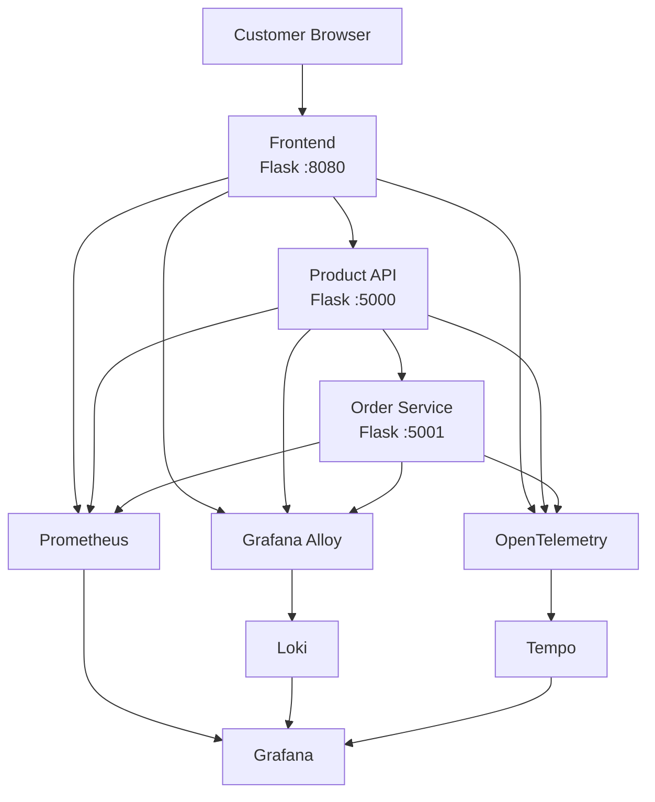

# E-Commerce Application with Full Observability

**Docker • Flask • Prometheus • Grafana • Loki • Alloy • Tempo • OpenTelemetry**

A beginner-friendly, 3-service e-commerce demo application with full observability (metrics, logs, and traces), designed to be deployed on AWS EC2.

---

## Table of Contents

1. [Project Overview](#1-project-overview)
2. [What This Project Demonstrates](#2-what-this-project-demonstrates)
3. [Architecture](#3-architecture)
4. [Application Request Flow](#4-application-request-flow)
5. [Observability Flow](#5-observability-flow)
6. [Technology Stack](#6-technology-stack)
7. [Project Structure](#7-project-structure)
8. [Prerequisites](#8-prerequisites)
9. [AWS Infrastructure](#9-aws-infrastructure)
10. [AWS Security Group](#10-aws-security-group)
11. [Clone the Repository](#11-clone-the-repository)
12. [Configure IP Addresses](#12-configure-ip-addresses)
13. [Deploy the E-Commerce Application](#13-deploy-the-e-commerce-application)
14. [Application Endpoints](#14-application-endpoints)
15. [Prometheus Metrics Setup](#15-prometheus)
16. [Metrics](#16-metrics)
17. [Loki Logs Setup](#17-loki)
18. [Grafana Alloy Setup](#18-grafana-alloy)
19. [Tempo Tracing Setup](#19-tempo)
20. [OpenTelemetry](#20-opentelemetry)
21. [Grafana Datasources](#21-grafana-datasources)
22. [Grafana Dashboard](#22-grafana-dashboard)
23. [Test Metrics](#23-test-metrics)
24. [Test Logs](#24-test-logs)
25. [Test Distributed Tracing](#25-test-distributed-tracing)
26. [Test the E-Commerce UI](#26-test-the-e-commerce-ui)
27. [Useful Commands](#27-useful-commands)
28. [Troubleshooting](#28-troubleshooting)
29. [Security Notes](#29-security-notes)
30. [Future Improvements](#30-future-improvements)
31. [Learning Outcomes](#31-learning-outcomes)
32. [Quick Deployment Cheat Sheet](#32-quick-deployment-cheat-sheet)

---

## 1. Project Overview

This project is a small e-commerce application built specifically for **learning DevOps and observability**. It is not meant to be a real online store — it is meant to teach you how real companies monitor their applications.

The application has three parts:

```text
Frontend
Product API
Order Service
```

A customer visits the **Frontend**, browses products (served by the **Product API**), and places an order (handled by the **Order Service**). Behind the scenes, the whole system is watched by an observability stack:

```text
Metrics → Prometheus
Logs → Loki
Traces → Tempo
Visualization → Grafana
Log Collection → Grafana Alloy
Instrumentation → OpenTelemetry
```

In simple terms:

* **Metrics** tell us "how much / how many / how fast" (e.g., how many requests per second).
* **Logs** tell us "what happened" (e.g., an error message when something failed).
* **Traces** tell us "where a request traveled" (e.g., which services a single checkout passed through).

Together, metrics, logs, and traces are often called the **three pillars of observability**.

---

## 2. What This Project Demonstrates

```text
✓ Docker
✓ Docker Compose
✓ Flask microservices
✓ REST APIs
✓ Prometheus metrics
✓ Grafana dashboards
✓ Loki log aggregation
✓ Grafana Alloy
✓ OpenTelemetry
✓ Grafana Tempo
✓ Distributed tracing
✓ AWS EC2 deployment
✓ Git/GitHub
```

The goal is to understand the **complete observability lifecycle** — from an application producing data, to that data being collected, stored, and finally visualized in one place.

---

## 3. Architecture



**Important:** Prometheus, Loki, Tempo, Alloy, Grafana, and OpenTelemetry are all **monitoring/observability components**. They are not part of what the customer sees — they quietly watch the application in the background.

---

## 4. Application Request Flow

The normal customer-facing flow looks like this:

```text
Customer
   |
   v
Frontend
   |
   | HTTP
   v
Product API
   |
   | HTTP
   v
Order Service
```

The **checkout flow** specifically looks like this:

```text
Browser
   |
   v
Frontend /api/checkout
   |
   v
Product API /checkout
   |
   v
Order Service /orders
```

This checkout flow is useful because it touches all three services in one request — it's the best flow to use when demonstrating **distributed tracing** later.

---

## 5. Observability Flow

There are three separate data flows, one for each pillar of observability.

### Metrics

```text
Application
    |
    | /metrics
    v
Prometheus
    |
    v
Grafana
```

Each service exposes an endpoint called `/metrics`. Prometheus periodically "scrapes" (fetches) this endpoint and stores the numbers over time. Grafana then reads that data from Prometheus and draws graphs.

### Logs

```text
Docker Containers
      |
      v
Grafana Alloy
      |
      v
Loki
      |
      v
Grafana
```

Every container prints log lines. Grafana Alloy watches Docker and picks up these log lines automatically, then forwards them to Loki, which stores them. Grafana can then search and display these logs.

### Traces

```text
Application
      |
      v
OpenTelemetry
      |
      | OTLP HTTP
      v
Tempo
      |
      v
Grafana
```

OpenTelemetry is a library built into each service. It records how a single request moves across services and sends that record to Tempo, which stores it. Grafana can then show you the full journey of one request.

---

## 6. Technology Stack

| Technology     | Purpose                      |
| -------------- | ----------------------------- |
| Python         | Application language          |
| Flask          | Web framework                 |
| Docker         | Containerization               |
| Docker Compose | Run multiple services together |
| Prometheus     | Metrics collection             |
| Grafana        | Visualization                  |
| Loki           | Log storage                    |
| Grafana Alloy  | Log collection                 |
| Tempo          | Trace storage                  |
| OpenTelemetry  | Application instrumentation    |
| AWS EC2        | Server infrastructure          |
| GitHub         | Source code management         |

---

## 7. Project Structure

```text
observability-demo/
│
├── docker-compose.yml
│
├── frontend/
│   ├── Dockerfile
│   ├── requirements.txt
│   └── app.py
│
├── product-api/
│   ├── Dockerfile
│   ├── requirements.txt
│   └── app.py
│
├── order-service/
│   ├── Dockerfile
│   ├── requirements.txt
│   └── app.py
│
└── alloy/
    └── config.alloy
```

**What each part does:**

* `docker-compose.yml` — tells Docker how to build and run all three services together.
* `frontend/` — the customer-facing website. This is what a customer actually sees and clicks on.
* `product-api/` — handles listing products and processing checkout requests.
* `order-service/` — handles creating and storing orders.
* `alloy/config.alloy` — configuration file that tells Grafana Alloy where to send collected logs.

> If your repository also includes Prometheus, Grafana, or Tempo configuration folders (for example `prometheus/`, `grafana/`, or `tempo/`), add them to this structure and briefly describe what each one does.

---

## 8. Prerequisites

Before you start, make sure you have:

* An **AWS account**
* **Two Ubuntu EC2 instances** (virtual servers on AWS)
* **Git** installed (used to download the project code)
* **Docker** installed (used to run the application in containers)
* **Docker Compose** installed (used to run multiple containers together)
* **SSH access** to both EC2 instances (used to log in to the servers remotely)
* Basic comfort using a terminal (typing and running commands)

**Why two servers?** One server runs the actual e-commerce application (the "Application Server"), and the other server runs the observability tools that watch it (the "Monitoring Server"). Separating them mirrors how real companies often isolate their monitoring infrastructure from their production application.

---

## 9. AWS Infrastructure

### Application Server

Runs:

```text
frontend
product-api
order-service
Grafana Alloy
```

### Monitoring Server

Runs:

```text
Prometheus
Grafana
Loki
Tempo
```

Throughout this README, the following placeholders are used instead of real IP addresses. Replace them with your own values:

```text
APP_PRIVATE_IP
APP_PUBLIC_IP
MONITORING_PRIVATE_IP
MONITORING_PUBLIC_IP
```

**To find a server's private IP**, run this on that server:

```bash
hostname -I
```

The first address shown is usually the private IP. The **public IP** is shown on the EC2 instance details page in the AWS Console.

---

## 10. AWS Security Group

A Security Group is AWS's firewall — it controls which ports on your server can be reached, and from where.

### Application EC2

| Port | Purpose        | Recommended Source          |
| ---- | -------------- | ---------------------------- |
| 22   | SSH            | My IP                        |
| 8080 | E-Commerce UI  | My IP / required users       |
| 5000 | Product API    | Internal only if possible    |
| 5001 | Order Service  | Internal only if possible    |

### Monitoring EC2

| Port | Purpose          | Recommended Source     |
| ---- | ---------------- | ------------------------ |
| 22   | SSH              | My IP                    |
| 3000 | Grafana          | My IP                    |
| 9090 | Prometheus       | My IP or internal        |
| 3100 | Loki             | Application server       |
| 4318 | Tempo OTLP HTTP  | Application server       |
| 3200 | Tempo API        | Internal/admin           |

Avoid opening every port to:

```text
0.0.0.0/0
```

(This means "anyone on the internet can access this port.") Only do this temporarily if you're testing and are certain of what you're doing.

---

## 11. Clone the Repository

Run this on your **Application Server**:

```bash
git clone YOUR_GITHUB_REPOSITORY_URL
cd observability-demo
```

* `git clone` downloads a copy of the project code from GitHub onto your server.
* `cd observability-demo` moves your terminal into the newly downloaded project folder.

---

## 12. Configure IP Addresses

Before deploying, you must replace the placeholder IPs in your configuration files with your real ones.

At minimum, you need to set:

```text
MONITORING_PRIVATE_IP
```

in your OpenTelemetry configuration (so traces know where Tempo is).

The **Alloy Loki endpoint** should point to:

```text
http://MONITORING_PRIVATE_IP:3100/loki/api/v1/push
```

**Prometheus** should be configured to scrape (fetch data from):

```text
APP_PRIVATE_IP:8080
APP_PRIVATE_IP:5000
APP_PRIVATE_IP:5001
```

**Why private IPs?** Private IPs only work *inside* AWS's internal network and are not reachable from the public internet. Using them for server-to-server communication is faster and more secure than routing traffic through the public internet.

---

## 13. Deploy the E-Commerce Application

Run these commands on the **Application Server**, inside the project folder:

```bash
cd ~/observability-demo

docker compose build

docker compose up -d

docker compose ps
```

* `docker compose build` — builds the container images for all three services from their Dockerfiles.
* `docker compose up -d` — starts all the containers in the background (`-d` means "detached").
* `docker compose ps` — shows the current status of all containers.

**Expected result:**

```text
frontend       Up
product-api    Up
order-service  Up
```

If a service is not "Up", check its logs:

```bash
docker compose logs frontend
docker compose logs product-api
docker compose logs order-service
```

---

## 14. Application Endpoints

| Service       | Endpoint          | Purpose               |
| ------------- | ----------------- | ---------------------- |
| Frontend      | `/`                | Customer UI             |
| Frontend      | `/health`          | Health check            |
| Frontend      | `/api/products`    | Product proxy           |
| Frontend      | `/api/checkout`     | Checkout proxy          |
| Frontend      | `/metrics`          | Prometheus metrics      |
| Product API   | `/products`          | Product list             |
| Product API   | `/products/<id>`     | Product details          |
| Product API   | `/checkout`           | Checkout processing      |
| Product API   | `/health`             | Health check              |
| Product API   | `/metrics`             | Prometheus metrics         |
| Order Service | `/orders`               | Get orders                  |
| Order Service | `/health`                | Health check                 |
| Order Service | `/metrics`                | Prometheus metrics            |

**Important:** `/metrics` is required by Prometheus and must **not** be removed. However, `/metrics` should be **excluded** from:

* application request counters
* OpenTelemetry traces

This is done in the application code like this:

```python
if request.path == "/metrics":
    return response
```

and:

```python
FlaskInstrumentor().instrument_app(
    app,
    excluded_urls="metrics"
)
```

**Why?** If `/metrics` is counted like a normal customer request, your metrics and traces get "polluted" by Prometheus's own background scraping — every few seconds you'd see fake "traffic" that has nothing to do with real customers. Excluding it keeps your data clean and focused on actual application behavior.

---

## 15. Prometheus

**Prometheus** is a tool that collects and stores metrics over time by repeatedly asking each service, "what are your current numbers?"

It does this by sending:

```text
GET /metrics
```

to each service, on a regular schedule (e.g., every 15 seconds).

Example `prometheus.yml`:

```yaml
scrape_configs:

  - job_name: "simple-frontend"
    static_configs:
      - targets:
          - "APP_PRIVATE_IP:8080"

  - job_name: "product-api"
    static_configs:
      - targets:
          - "APP_PRIVATE_IP:5000"

  - job_name: "order-service"
    static_configs:
      - targets:
          - "APP_PRIVATE_IP:5001"
```

Place this file on your **Monitoring Server**, and run Prometheus so that it loads this configuration (for example, mounting it into a Prometheus Docker container).

---

## 16. Metrics

The application exposes these metrics:

```text
frontend_requests_total
frontend_request_duration_seconds

product_api_requests_total
product_api_request_duration_seconds

order_service_requests_total
order_service_request_duration_seconds
```

* A **counter** (like `..._requests_total`) is a number that only ever goes up — it counts how many times something happened.
* A **histogram** (like `..._request_duration_seconds`) records how long things took, bucketed into ranges, so you can calculate averages, percentiles, etc.

### Useful PromQL queries

**Request rate** (requests per second, averaged over the last 5 minutes):

```promql
sum(rate(frontend_requests_total[5m]))
+
sum(rate(product_api_requests_total[5m]))
+
sum(rate(order_service_requests_total[5m]))
```

**Recent request count** (total requests in the last 5 minutes):

```promql
sum(increase(frontend_requests_total[5m]))
+
sum(increase(product_api_requests_total[5m]))
+
sum(increase(order_service_requests_total[5m]))
```

**Why does one checkout produce ~3 requests?** Because a single checkout click passes through the Frontend, then the Product API, then the Order Service — each service records its own request, so one customer action shows up as roughly three service-level requests.

---

## 17. Loki

**Loki** is a system for storing and searching logs (text messages that applications print out, usually describing what just happened).

Flow:

```text
Docker stdout/stderr
       |
       v
Alloy
       |
       v
Loki
       |
       v
Grafana
```

### Useful LogQL queries

All logs:

```logql
{job="docker"}
```

Only frontend logs:

```logql
{job="docker", service="frontend"}
```

Only product-api logs:

```logql
{job="docker", service="product-api"}
```

Only order-service logs:

```logql
{job="docker", service="order-service"}
```

Only product-api logs containing the word "ERROR":

```logql
{job="docker", service="product-api"} |= "ERROR"
```

---

## 18. Grafana Alloy

**Grafana Alloy** is the agent responsible for reading logs directly from Docker and shipping them to Loki.

Complete `config.alloy`:

```alloy
discovery.docker "containers" {
  host = "unix:///var/run/docker.sock"
}

discovery.relabel "docker_logs" {
  targets = discovery.docker.containers.targets

  rule {
    source_labels = ["__meta_docker_container_label_com_docker_compose_service"]
    target_label = "service"
  }
}

loki.source.docker "containers" {
  host = "unix:///var/run/docker.sock"

  targets = discovery.relabel.docker_logs.output

  labels = {
    job = "docker",
  }

  forward_to = [
    loki.write.monitoring.receiver,
  ]
}

loki.write "monitoring" {
  endpoint {
    url = "http://MONITORING_PRIVATE_IP:3100/loki/api/v1/push"
  }
}
```

**Remember to replace** `MONITORING_PRIVATE_IP` with your actual monitoring server's private IP address.

To check if Alloy is running correctly:

```bash
sudo systemctl status alloy
```

---

## 19. Tempo

**Tempo** is a tool that stores traces — records of how a single request traveled across multiple services.

Two important ports:

```text
4318 = OTLP HTTP ingestion   (where applications SEND traces to)
3200 = Tempo query/API       (where Grafana READS traces from)
```

Applications send their trace data to:

```text
http://MONITORING_PRIVATE_IP:4318/v1/traces
```

---

## 20. OpenTelemetry

**OpenTelemetry** is a library added to each service that automatically records how requests move through the system.

Key terms:

* **Trace** — the complete journey of one request, from start to finish, across all services it touched.
* **Span** — one single step within a trace (e.g., "Product API handled a checkout request").
* **Trace ID** — a unique identifier shared by every span belonging to the same request, so they can all be grouped together.
* **Service name** — which service produced a given span.
* **Parent/child span** — spans can be nested; a "parent" span (e.g., the Frontend's request) can contain "child" spans (e.g., the Product API call it triggered).

Example of one checkout trace:

```text
Trace ID: abc123

frontend
   |
   +--- GET /api/checkout
          |
          +--- product-api
                  |
                  +--- GET /checkout
                          |
                          +--- order-service
                                  |
                                  +--- GET /orders
```

This single trace, spanning three services, is what makes this **distributed tracing** — you're tracing one request as it's distributed across multiple independent services.

---

## 21. Grafana Datasources

Configure the following datasources in Grafana. Assuming Grafana, Prometheus, Loki, and Tempo are all running on the same Monitoring EC2 instance, they can reach each other over `localhost`:

**Prometheus:**

```text
http://localhost:9090
```

**Loki:**

```text
http://localhost:3100
```

**Tempo:**

```text
http://localhost:3200
```

Add each of these under Grafana's **Connections → Data sources** page.

---

## 22. Grafana Dashboard

A recommended dashboard layout:

**Metrics panels:**

```text
Total Request Rate
Frontend Request Rate
Product API Request Rate
Order Service Request Rate
Request Latency
Service Health
```

**Log panels:**

```text
Application Logs
Error Logs
```

**Trace panels:**

```text
Recent Traces
```

This is the real power of Grafana: it can combine **Metrics + Logs + Traces** into a single dashboard, so you can go from "something looks slow" (metrics) → "here's the error message" (logs) → "here's exactly which service caused it" (traces), all in one place.

---

## 23. Test Metrics

Confirm each service is exposing metrics correctly:

```bash
curl http://APP_PRIVATE_IP:8080/metrics
curl http://APP_PRIVATE_IP:5000/metrics
curl http://APP_PRIVATE_IP:5001/metrics
```

Each command should return a page of plain text metrics data.

Then, in Prometheus, go to **Status → Targets** and confirm:

```text
simple-frontend   UP
product-api       UP
order-service     UP
```

If any target shows `DOWN`, see the [Troubleshooting](#28-troubleshooting) section.

---

## 24. Test Logs

Generate some traffic:

```bash
curl http://localhost:8080/api/products
curl http://localhost:8080/api/checkout
```

Then check the raw Docker logs:

```bash
docker compose logs frontend
docker compose logs product-api
docker compose logs order-service
```

Finally, confirm the same log lines appear in Grafana: go to **Explore**, select the **Loki** datasource, and run a query such as `{job="docker"}`.

---

## 25. Test Distributed Tracing

Send a request that touches all three services:

```bash
curl http://localhost:8080/api/checkout
```

The resulting trace should show:

```text
frontend
   ↓
product-api
   ↓
order-service
```

In Grafana, go to **Explore**, select the **Tempo** datasource, and search for recent traces. You should see one trace containing spans from all three services.

**Important:** Do **not** use `/metrics` to test distributed tracing. `/metrics` is monitoring traffic (Prometheus scraping) and is intentionally excluded from OpenTelemetry traces — testing with it will not produce a meaningful multi-service trace.

---

## 26. Test the E-Commerce UI

Open in your browser:

```text
http://APP_PUBLIC_IP:8080
```

Walk through this test flow:

```text
1. Open website
2. Products appear
3. Click Details
4. Add product to cart
5. Open cart
6. Click checkout
7. See confirmation
```

Remember: Prometheus, Loki, and Tempo are background observability systems. A customer using the website will never see them — they only appear when you (as the developer/operator) open Grafana separately.

---

## 27. Useful Commands

```bash
docker compose ps              # List running containers and their status
docker compose logs            # Show logs for all services
docker compose logs -f         # Follow (stream) logs in real time
docker compose restart         # Restart all containers
docker compose down            # Stop and remove all containers
docker compose up -d           # Start all containers in the background
docker compose build           # Build container images
docker compose build --no-cache # Rebuild images from scratch, ignoring cache
```

```bash
docker ps          # List all running containers on this server
docker images      # List all downloaded/built container images
docker network ls  # List Docker networks
```

---

## 28. Troubleshooting

### Frontend container exits

```bash
docker compose logs frontend
```

Look for a Python error or a missing environment variable in the output.

### Product API unavailable

```bash
docker compose exec frontend curl http://product-api:5000/health
```

If this fails, the Product API container may not be running, or its internal networking may be misconfigured.

### Order Service unavailable

```bash
docker compose exec product-api curl http://order-service:5001/health
```

Same idea — this tests connectivity from inside the Product API container to the Order Service.

### Prometheus target shows DOWN

Check that each service is reachable directly:

```bash
curl http://APP_PRIVATE_IP:8080/metrics
curl http://APP_PRIVATE_IP:5000/metrics
curl http://APP_PRIVATE_IP:5001/metrics
```

If these fail, check your AWS Security Group rules — Prometheus (on the Monitoring Server) needs permission to reach these ports on the Application Server.

### Logs not appearing in Loki

Check Alloy's status:

```bash
sudo systemctl status alloy
```

Check that Alloy can access the Docker socket:

```bash
ls -l /var/run/docker.sock
```

### Traces not appearing in Tempo

Check:

* The OTLP endpoint configured in your application matches your Monitoring Server's private IP
* Port `4318` is open in the Security Group
* OpenTelemetry packages are installed correctly in each service
* Application logs for any OpenTelemetry connection errors

### Only one service appears in a trace

This usually means `/metrics` traffic has slipped into your trace data (it naturally produces single-service traces if not excluded). Instead, test with:

```bash
curl http://localhost:8080/api/checkout
```

Expected result:

```text
frontend
→ product-api
→ order-service
```

---

## 29. Security Notes

* Never commit passwords to your repository.
* Never commit AWS access keys.
* Never commit private SSH keys.
* Never expose unnecessary ports to the public internet.
* Prefer private IPs for internal server-to-server communication.
* Restrict Grafana access to trusted IPs only.
* Use environment variables or a secrets manager for sensitive configuration — never hard-code secrets into files.

This project is a **learning/demo project** and should be further hardened (see [Future Improvements](#30-future-improvements)) before any real production use.

---

## 30. Future Improvements

```text
- Real database
- Real order creation
- Authentication
- HTTPS
- Nginx reverse proxy
- TLS
- Kubernetes
- Terraform
- CI/CD
- Alertmanager
- Application error tracking
- Better Grafana dashboards
- Production security hardening
```

---

## 31. Learning Outcomes

By completing this project, you will understand:

```text
1. How Docker containers communicate
2. How Flask APIs work
3. How Prometheus collects metrics
4. How Grafana visualizes metrics
5. How Docker logs are collected
6. How Alloy forwards logs
7. How Loki stores logs
8. How OpenTelemetry instruments applications
9. How Tempo stores traces
10. How distributed tracing follows a request across services
11. How AWS EC2 servers communicate using private IPs
```

---

## 32. Quick Deployment Cheat Sheet

```bash
# Clone
git clone YOUR_REPOSITORY_URL
cd observability-demo

# Build
docker compose build

# Start
docker compose up -d

# Check
docker compose ps

# Test
curl http://localhost:8080/health
curl http://localhost:8080/api/products
curl http://localhost:8080/api/checkout

# Logs
docker compose logs frontend
docker compose logs product-api
docker compose logs order-service

# Restart
docker compose restart

# Stop
docker compose down
```

**Access the deployed services at:**

```text
Application:
http://APP_PUBLIC_IP:8080

Grafana:
http://MONITORING_PUBLIC_IP:3000
```
