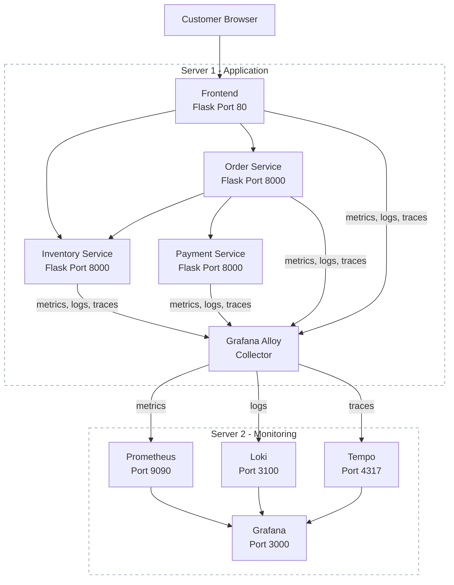
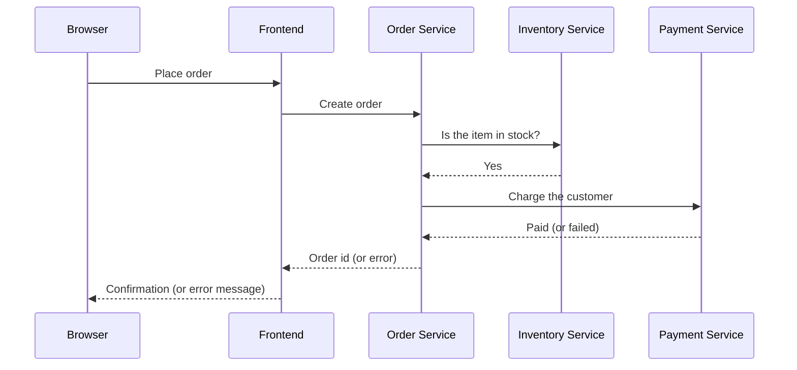

# Observability Demo: Metrics, Logs and Traces with Grafana

A small online shop made of four services, plus a complete monitoring setup. You can clone it, run a few commands on two servers, and watch the shop's **metrics**, **logs** and **traces** live in Grafana.

No monitoring experience is needed. Everything below is explained in plain words.

---

## Table of contents

1. [What is this project?](#1-what-is-this-project)
2. [Monitoring in simple words](#2-monitoring-in-simple-words)
3. [Architecture](#3-architecture)
4. [What happens when someone places an order](#4-what-happens-when-someone-places-an-order)
5. [What you need before starting](#5-what-you-need-before-starting)
6. [Deploy step by step](#6-deploy-step-by-step)
7. [Use the shop and create data](#7-use-the-shop-and-create-data)
8. [Look at the data in Grafana](#8-look-at-the-data-in-grafana)
9. [Project structure](#9-project-structure)
10. [Troubleshooting](#10-troubleshooting)
11. [Stop and clean up](#11-stop-and-clean-up)
12. [Security notes](#12-security-notes)


---

## 1. What is this project?

It has two parts:

| Part | What it is | Where it runs |
|---|---|---|
| **The shop (application)** | A web page where you pick a product and place an order. Behind it are 4 small services. | Server 1 |
| **The monitoring stack** | Tools that collect and display what the shop is doing: how fast it is, what it wrote in its diary, and the path each order took. | Server 2 |

The shop has buttons that create a slow payment or a failed payment on purpose. This gives you something interesting to look at in Grafana.

---

## 2. Monitoring in simple words

Think of the shop as a restaurant. To know how the restaurant is doing, you need three kinds of information.

| Type | Restaurant example | What it tells you | Tool used here |
|---|---|---|---|
| **Metrics** | Numbers on a board: orders per minute, average waiting time, how many dishes failed | Is the system healthy right now? Is something getting slower? | **Prometheus** |
| **Logs** | The diary: "10:02 Table 4 ordered pasta", "10:03 Payment failed" | What exactly happened, in words? | **Loki** |
| **Traces** | The journey of one order: waiter, then kitchen, then cashier, with the time spent at each stop | Where did this one request spend its time or fail? | **Tempo** |

**Grafana** is the screen on the wall that shows all three in one place.

Each request gets a unique **Trace ID**, like a parcel tracking number. Every log line of that request carries the same number. In Grafana you click the number in a log line and the full journey opens.

---

## 3. Architecture


```mermaid
flowchart TD

    User["Customer Browser"]

    subgraph S1["Server 1 - Application"]
        Frontend["Frontend<br/>Flask Port 80"]
        Order["Order Service<br/>Flask Port 8000"]
        Inventory["Inventory Service<br/>Flask Port 8000"]
        Payment["Payment Service<br/>Flask Port 8000"]
        Alloy["Grafana Alloy<br/>Collector"]
    end

    subgraph S2["Server 2 - Monitoring"]
        Prometheus["Prometheus<br/>Port 9090"]
        Loki["Loki<br/>Port 3100"]
        Tempo["Tempo<br/>Port 4317"]
        Grafana["Grafana<br/>Port 3000"]
    end

    User --> Frontend
    Frontend --> Inventory
    Frontend --> Order
    Order --> Inventory
    Order --> Payment

    Frontend -->|"metrics, logs, traces"| Alloy
    Order -->|"metrics, logs, traces"| Alloy
    Inventory -->|"metrics, logs, traces"| Alloy
    Payment -->|"metrics, logs, traces"| Alloy

    Alloy -->|"metrics"| Prometheus
    Alloy -->|"logs"| Loki
    Alloy -->|"traces"| Tempo

    Prometheus --> Grafana
    Loki --> Grafana
    Tempo --> Grafana

    style S1 fill:transparent,stroke:#8a94a6,stroke-dasharray:5 5
    style S2 fill:transparent,stroke:#8a94a6,stroke-dasharray:5 5
```

### The pieces

| Component | Job | Port |
|---|---|---|
| **Frontend** | The web page customers see. Passes orders to the Order Service. | 80 |
| **Order Service** | Receives an order, checks stock, then asks for payment. | internal |
| **Inventory Service** | Knows which products exist and how many are in stock. | internal |
| **Payment Service** | Pretends to charge the customer. Sometimes slow or failing, on purpose. | internal |
| **Grafana Alloy** | A courier. Collects metrics, logs and traces from the app and delivers them to Server 2. | 12345 (its own status page) |
| **Prometheus** | Stores metrics (numbers over time). | 9090 |
| **Loki** | Stores logs. | 3100 |
| **Tempo** | Stores traces. | 4317 |
| **Grafana** | The dashboards and search screens. | 3000 |

### How each kind of data travels

- **Metrics:** each service shows its numbers at `/metrics`. Alloy reads them every 15 seconds and sends them to Prometheus.
- **Logs:** each service prints one JSON line per event. Alloy reads the Docker logs and sends them to Loki.
- **Traces:** each service uses OpenTelemetry (a standard library that records the journey of a request) and sends it to Alloy. Alloy forwards it to Tempo.

Because everything leaves Server 1 through one courier (Alloy), you only need to open three ports on Server 2.

---

## 4. What happens when someone places an order


```mermaid
sequenceDiagram
    participant B as Browser
    participant F as Frontend
    participant O as Order Service
    participant I as Inventory Service
    participant P as Payment Service

    B->>F: Place order
    F->>O: Create order
    O->>I: Is the item in stock?
    I-->>O: Yes
    O->>P: Charge the customer
    P-->>O: Paid (or failed)
    O-->>F: Order id (or error)
    F-->>B: Confirmation (or error message)
```

All four services record their part under **one Trace ID**. That is why Tempo can draw the whole journey as one picture.

---

## 5. What you need before starting

- **Two Linux servers** (this was built and tested on Ubuntu EC2 instances). Both must be able to reach each other over the network. If you use AWS, put them in the same VPC.
- **Docker and Docker Compose** on both servers.
- **A computer with a browser** to open the shop and Grafana.
- About **2 GB of RAM** per server is a comfortable minimum.

### Install Docker (run on both servers)

```bash
sudo apt update
sudo apt install -y ca-certificates curl git
sudo install -m 0755 -d /etc/apt/keyrings
sudo curl -fsSL https://download.docker.com/linux/ubuntu/gpg -o /etc/apt/keyrings/docker.asc
sudo chmod a+r /etc/apt/keyrings/docker.asc
echo "deb [arch=$(dpkg --print-architecture) signed-by=/etc/apt/keyrings/docker.asc] https://download.docker.com/linux/ubuntu $(. /etc/os-release && echo "${UBUNTU_CODENAME:-$VERSION_CODENAME}") stable" | sudo tee /etc/apt/sources.list.d/docker.list > /dev/null
sudo apt update
sudo apt install -y docker-ce docker-ce-cli containerd.io docker-buildx-plugin docker-compose-plugin
sudo usermod -aG docker $USER
newgrp docker
```

Check it worked:

```bash
docker --version
docker compose version
```

### Open the right ports (firewall or AWS Security Group)

**Server 2 (monitoring)**

| Port | Open to | Why |
|---|---|---|
| 22 | Your IP | SSH |
| 3000 | Your IP | Grafana in your browser |
| 9090, 3100, 4317 | **Server 1's private IP only** | Alloy sends data here |

**Server 1 (application)**

| Port | Open to | Why |
|---|---|---|
| 22 | Your IP | SSH |
| 80 | Your IP (or everyone, for a public demo) | The shop |
| 12345 | Your IP, optional | Alloy status page |

Write down both servers' **private IPs** (like `172.31.x.x`). Server 1 uses Server 2's private IP to send data.

---

## 6. Deploy step by step

Always start with **Server 2**, so the monitoring tools are ready before data arrives.

### Step 1: Get the code on both servers

```bash
git clone <your-repository-url> observability-demo
cd observability-demo
```

### Step 2: Start Server 2 (monitoring)

```bash
cd server2
GRAFANA_PASSWORD=choose_a_strong_password docker compose up -d
docker compose ps
```

You should see four containers running: `prometheus`, `loki`, `tempo`, `grafana`.

Open `http://SERVER2_PUBLIC_IP:3000` and log in with user `admin` and your password. The dashboards will be empty for now. That is expected.

### Step 3: Check that Server 1 can reach Server 2

Run this on **Server 1** (install `netcat` first if needed: `sudo apt install -y netcat-openbsd`):

```bash
nc -zv SERVER2_PRIVATE_IP 9090
nc -zv SERVER2_PRIVATE_IP 3100
nc -zv SERVER2_PRIVATE_IP 4317
```

All three should say `succeeded`. If not, fix your firewall or Security Group first.

### Step 4: Start Server 1 (application)

```bash
cd observability-demo/server1
cp .env.example .env
nano .env
```

Set the line to Server 2's **private IP**:

```
SERVER2_IP=172.31.x.x
```

Save and exit (`Ctrl+O`, `Enter`, `Ctrl+X`). Then:

```bash
docker compose up -d --build
docker compose ps
```

The first build takes 2 to 3 minutes. You should see five containers running: `frontend`, `order-service`, `inventory-service`, `payment-service`, `alloy`.

### Step 5: Quick health check

```bash
curl -s -o /dev/null -w "%{http_code}\n" http://localhost
```

It should print `200`.

---

## 7. Use the shop and create data

1. Open `http://SERVER1_PUBLIC_IP` in your browser.
2. Pick a product, choose a quantity, and click **Place order**.
3. Try the **Test scenarios** buttons too:
   - **Slow payment:** the order takes 2 to 3 seconds.
   - **Failed payment:** the order fails, and an error is logged.

To generate steady traffic automatically, run this on Server 1 and leave it for 4 to 5 minutes (`Ctrl+C` to stop):

```bash
cd observability-demo/server1
./loadgen.sh http://localhost
```

---

## 8. Look at the data in Grafana

Open `http://SERVER2_PUBLIC_IP:3000`.

### Metrics and logs: the dashboard

Go to **Dashboards**, open the **Demo** folder, then **Demo Shop Overview**.

| Panel | What it shows |
|---|---|
| Request rate | How many requests per second each service handles |
| Error rate | The share of requests that failed |
| Latency p95 | How long the slowest 5% of requests took |
| Requests by status code | How many succeeded (2xx) or failed (5xx) |
| Error logs | Only the error lines from all services |
| All logs | Every log line |

Set the time range at the top right to **Last 15 minutes**.

### From a log line to the full journey

1. In **Error logs**, click any log line to expand it.
2. Find the **TraceID** link and click it.
3. Tempo opens the trace: every service the request passed through, and how long each step took.

### Search traces directly

1. Open **Explore** in the left menu and choose the **Tempo** data source.
2. Search by service name, for example `order-service`, and run the query.
3. Click any trace to see its steps.

### Ask Prometheus or Loki directly

In **Explore**, try these:

| Data source | Query | Meaning |
|---|---|---|
| Prometheus | `http_requests_total` | Total requests, split by service and status |
| Loki | `{service="payment-service"}` | All logs from the payment service |

---

## 9. Project structure

```
observability-demo/
├── README.md
├── server1/                      # Run on the application server
│   ├── docker-compose.yml        # Starts the 4 services and Alloy
│   ├── .env.example              # Copy to .env and set SERVER2_IP
│   ├── loadgen.sh                # Sends fake orders to create data
│   ├── alloy/
│   │   └── config.alloy          # Tells Alloy what to collect and where to send it
│   └── services/
│       ├── Dockerfile
│       ├── requirements.txt
│       ├── common.py             # Shared code: metrics, JSON logs, tracing
│       ├── frontend.py           # The web page
│       ├── order.py              # Order service
│       ├── inventory.py          # Inventory service
│       └── payment.py            # Payment service
└── server2/                      # Run on the monitoring server
    ├── docker-compose.yml        # Starts Prometheus, Loki, Tempo, Grafana
    ├── prometheus/prometheus.yml
    ├── loki/loki.yml
    ├── tempo/tempo.yml
    └── grafana/
        ├── provisioning/         # Connects Grafana to the 3 data sources automatically
        └── dashboards/
            └── demo-shop.json    # The ready-made dashboard
```

---

## 10. Troubleshooting

Run commands from the `server1` or `server2` folder.

| Problem | What to check |
|---|---|
| A container keeps showing `Restarting` | `docker compose logs <service-name> --tail 40` and read the last error lines |
| `curl http://localhost` prints `000` | The frontend is not running. Check `docker compose ps`, then its logs |
| Shop does not open in the browser | Use `http://` (not `https://`) and the server's **public** IP. Check that port 80 is open in the Security Group |
| Dashboard is empty | Place some orders or run `./loadgen.sh`. Set the time range to the last 15 minutes |
| Dashboard still empty after traffic | On Server 1 run `docker compose logs alloy --tail 30`. Errors like `connection refused` mean Server 2's ports are blocked, or `SERVER2_IP` in `.env` is wrong |
| No metrics | In Grafana Explore, run `http_requests_total` on Prometheus. If empty, the problem is between Alloy and Prometheus |
| No logs | In Grafana Explore, run `{service="order-service"}` on Loki |
| No traces | On Server 1 run `docker compose logs order-service --tail 20` and look for export errors. Check port 4317 on Server 2 |
| Changed `.env` but nothing changed | Run `docker compose up -d` again so containers pick up the new value |
| Changed Python code | Run `docker compose up -d --build` |

---

## 11. Stop and clean up

Stop everything but keep the data:

```bash
docker compose down
```

Stop and **delete all stored data** (metrics, logs and traces):

```bash
docker compose down -v
```

Run these in both `server1` and `server2`.

---

## 12. Security notes

This is a learning and demo setup, not production-ready.

- Traffic between the two servers is **not encrypted** and has **no password**. Keep ports 9090, 3100 and 4317 limited to Server 1's IP.
- Always set a strong `GRAFANA_PASSWORD`. The default is `admin`.
- Do not expose the Alloy status page (port 12345) to the whole internet.
- Data is kept for 7 days.

---
